# BÁO CÁO BÀI TẬP LỚN: DEEP LEARNING

**Group_5** - **Thành viên:**
* Hà Thanh Bình -2470732

* TrầnĐăng Hùng -2470750

* Nguyễn Võ Thái Triều-2470577

**Giảng viên hướng dẫn:** ***TS. Lê Thành Sách***

---

## 🔗 Tài nguyên Dự án
* 🎥 [Link Video Demo](#)
* 📺 [Link Video Thuyết trình (YouTube)](#)
* 💻 [Link Mã nguồn (Colab/GitHub)](https://colab.research.google.com/drive/1IkOrkJAU0QA_ijNUROs1dWSIBxncNADJ?usp=sharing)
* [Link report PDF](https://drive.google.com/file/d/1Q-3MexnU4b1K2JtLwcPjH3L3RgybF53o/view?usp=sharing)

---
## IMAGE CLASSIFICATION
### 1. Tìm hiểu Bài toán & EDA
#### Tập dữ liệu Intel Image

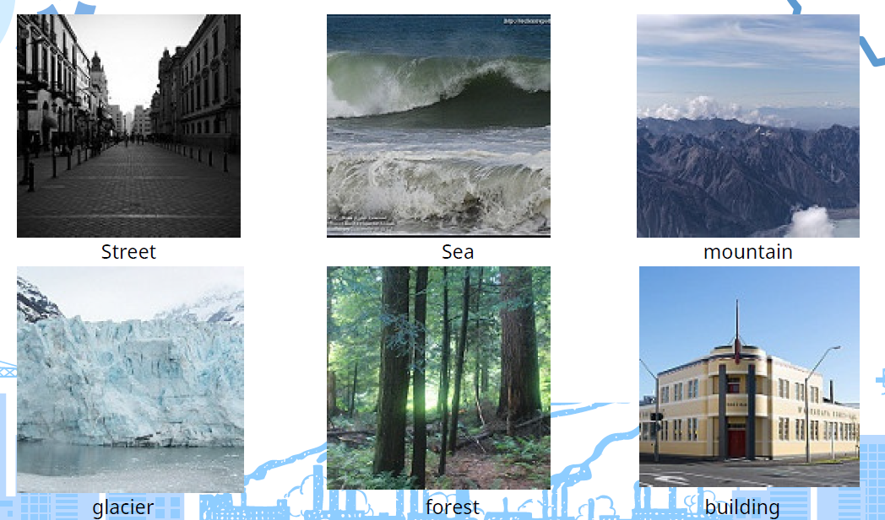

[Dataset Link intel-image-classification](https://www.kaggle.com/datasets/puneet6060/intel-image-classification)

### 2. Chuẩn bị Dataset và Augmentation
1. Data Augmentation: Áp dụng RandomHorizontalFlip và RandomRotation(15) cho tập
Train nhằm tăng sự đa dạng của dữ liệu lên gấp nhiều lần, giúp mô hình ResNet50
tránh hiện tượng Overfitting.
2. Data Normalization: Chuẩn hóa theo thông số ImageNet (mu, sigma) để tận dụng tối
đa tri thức từ các mô hình Pre-trained.
3. Data Splitting: Sử dụng chiến lược Stratified Split (90/10) để đảm bảo sự cân bằng
về phân phối lớp giữa tập huấn luyện và tập kiểm thử. Tập Validation được tách biệt
hoàn toàn và chỉ áp dụng các phép biến đổi hình học cơ bản (Resize) để đảm bảo
tính khách quan trong đánh giá.
4. Dataloader Optimization: Thiết lập batch_size=128 và num_workers=2 để tối ưu hóa
tốc độ nạp dữ liệu vào GPU, giúp rút ngắn thời gian huấn luyện.

### 3. Huấn luyện & So sánh Mô hình
| Bài toán | Mô hình 1 | Mô hình 2 | Kỹ thuật đặc biệt |
| :--- | :--- | :--- | :--- |
| **Ảnh** | ResNet50 (CNN) | ViT (Transformer) | Ensemble Voting |
#### Resnet50
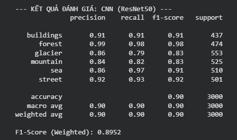
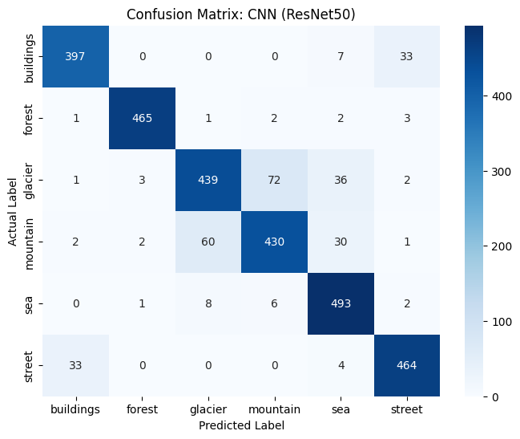
#### ViT
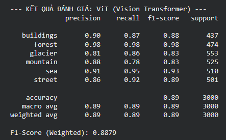
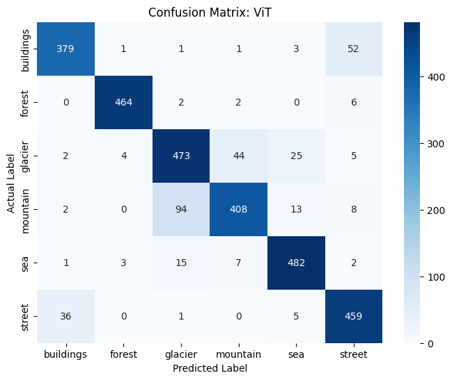
#### Restnet50 + Vit
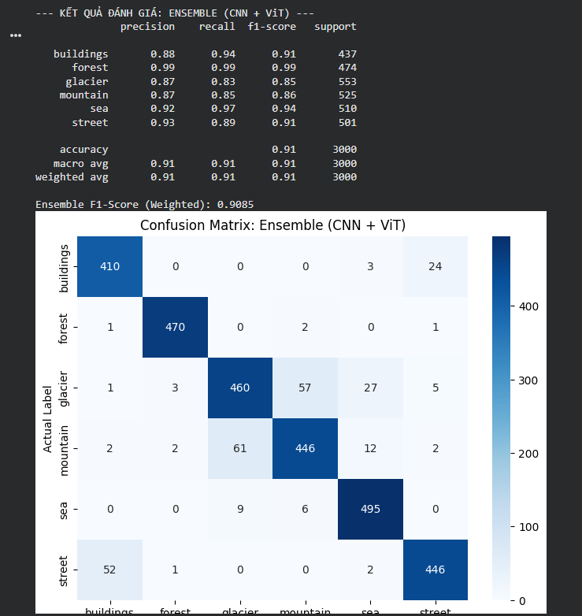

## Emotion Classification
### 1. Tập dữ liệu Emotion
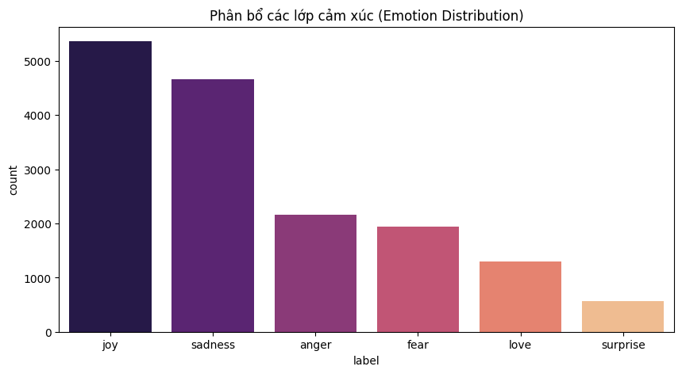
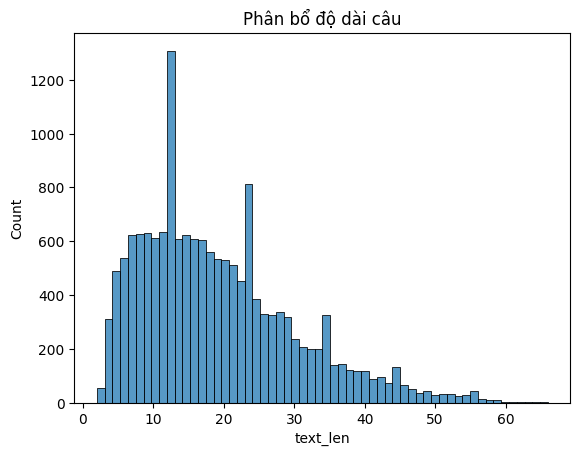

[Dataset Link Emotion](https://www.kaggle.com/datasets/praveengovi/emotions-dataset-for-nlp/data)

### 2. Pipeline Tiền xử lý văn bản cho Bi-LSTM
1. Tokenization: Sử dụng Regular Expression để tách từ và chuẩn hóa về chữ thường.
2. Vocabulary Construction: Xây dựng bộ từ điển dựa trên tập huấn luyện, thiết lập các token đặc biệt <pad> và <unk> để xử lý các câu có độ dài khác nhau và các từ nằm ngoài từ điển (Out-of-Vocabulary).
3. Vectorization & Padding: Toàn bộ các câu được số hóa thành chuỗi chỉ số (Indices) với độ dài cố định là 64. Kỹ thuật Padding giúp đồng bộ hóa dữ liệu đầu vào, cho phép huấn luyện theo cơ chế Batch Training hiệu quả trên GPU.

### 3. Huấn luyện & So sánh Mô hình
| Bài toán | Mô hình 1 | Mô hình 2 | Kỹ thuật đặc biệt |
| :--- | :--- | :--- | :--- |
| **Chữ** | Bi-LSTM (RNN) | DistilBERT | Unfreeze 2 layers |
#### Bi-LSTM
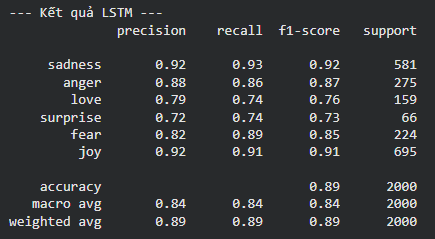
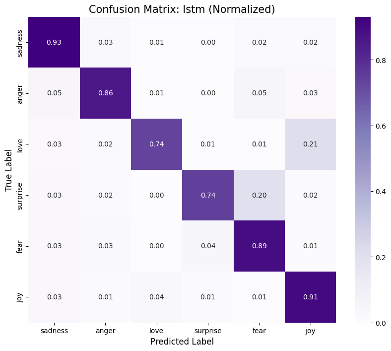

#### DistilBERT - Freeze All layer
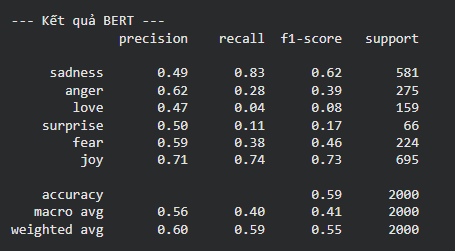
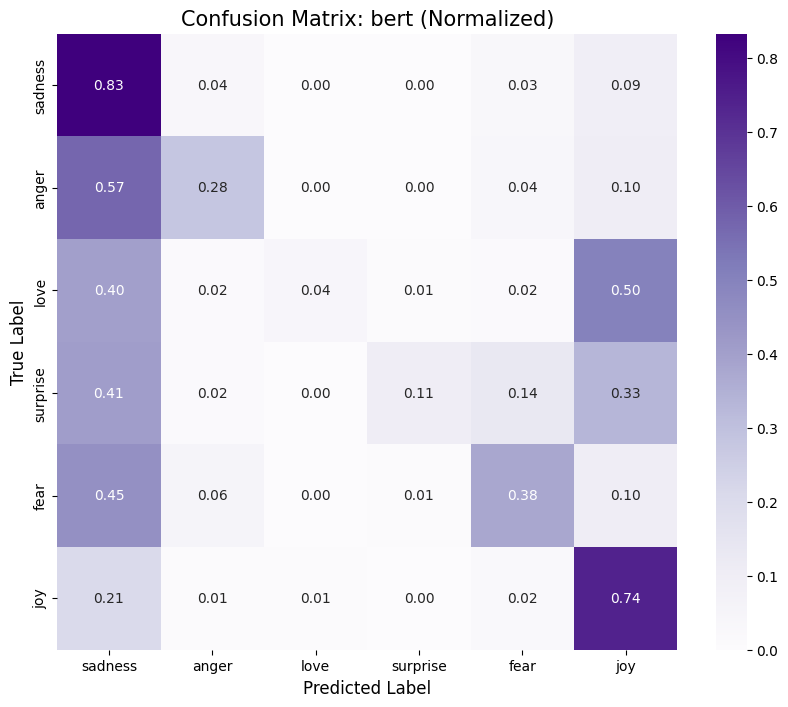

#### DistilBERT - Unfreeze 2 layers
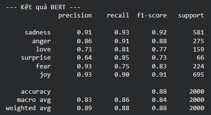
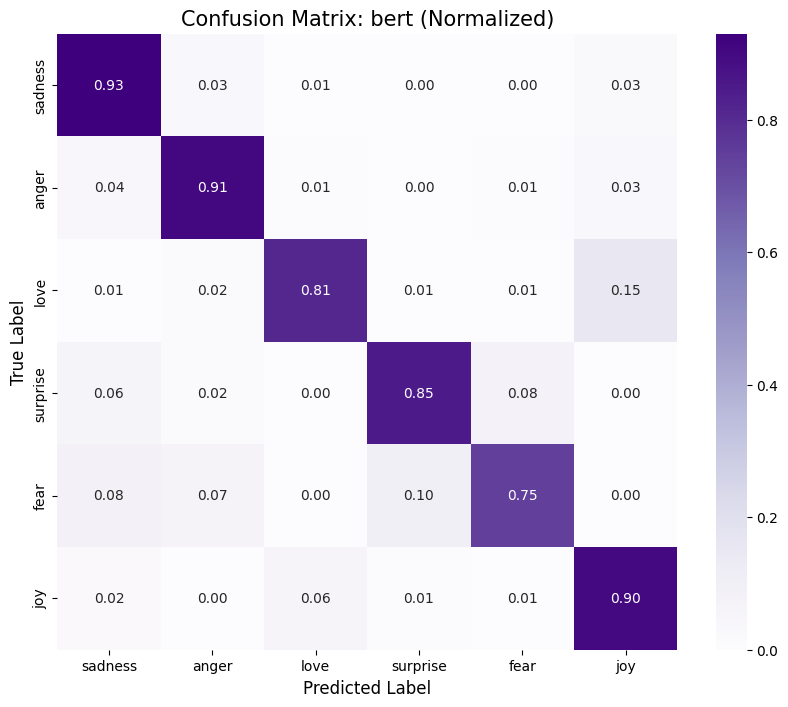

## MultiModel Approach
### 1. Tập dữ liệu
Flickr8k_Dataset: Chứa tổng cộng 8092 hình ảnh ở định dạng JPEG với hình dạng và kích
thước khác nhau. Trong đó, 6000 hình ảnh được sử dụng để huấn luyện, 1000 hình ảnh để
kiểm tra và 1000 hình ảnh để phát triển. Flickr8k_text: Chứa các tệp văn bản mô tả
train_set, test_set, Flickr8k. token

[Link dataset flickr image](https://www.kaggle.com/datasets/gazu468/flickr-8k-images)
### 2. Data Augenmentation và Prepocessing
- Lọc dữ liệu theo từ khóa (Keyword Filtering): Vì tập Flickr không có nhãn phân loại sẵn, xây dựng thuật toán quét tệp captions.txt để tìm các hình ảnh chứa từ khóa đặc trưng cho
từng lớp.
- Cấu trúc tập tin:
  - Few-shot Train: Lấy ngẫu nhiên 5 mẫu ảnh cho mỗi lớp (Tổng 30 mẫu).
  - Test Set: Lấy 20 mẫu ảnh độc lập cho mỗi lớp (Tổng 120 mẫu) để đánh giá khách quan.
- Tiền xử lý (Preprocessing): Sử dụng CLIPProcessor để chuẩn hóa kích thước ảnh về
224×224 và mã hóa văn bản (Tokenization) tương thích với kiến trúc Transformer của CLIP.
- Dữ liệu ảnh đa dạng về bối cảnh. Tập trung vào 6 lớp đối tượng phổ biến: Dog, Cat, Person, Car, Building, Mountain.

### 3. Hướng tiếp cận Zero-shot Classification
- Mô hình: openai/clip-vit-base-patch32.
- Cơ chế: Mô hình tính toán độ tương đồng (Cosine Similarity) giữa vector đặc trưng của ảnh và vector đặc trưng của 6 nhãn văn bản. Lớp có xác suất cao nhất (Softmax) sẽ được chọn làm kết quả dự đoán.
- Ưu điểm: Không cần huấn luyện lại, có khả năng nhận diện các khái niệm mới dựa trên kiến thức khổng lồ đã
học từ Internet.

### Hướng tiếp cận Few-shot Classification
- Cơ chế: Trích xuất đặc trưng ảnh (Image Embeddings) từ lớp pooler_output của CLIP.
- Huấn luyện: Sử dụng 30 mẫu ảnh ít ỏi để huấn luyện một bộ phân loại tuyến tính Logistic Regression.
- Mục đích: Kiểm tra khả năng thích nghi của mô hình với một lượng dữ liệu cực nhỏ (5 mẫu/lớp).

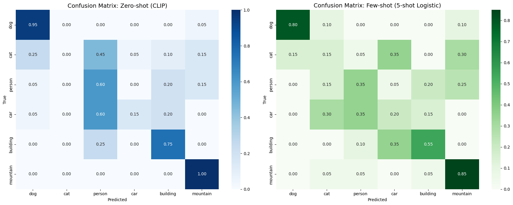

### Thảo luận
* **CNN vs Transformer:** CNN hội tụ nhanh hơn trên tập dữ liệu nhỏ.
* **LSTM vs BERT:** BERT vượt trội sau khi Fine-tune 2 tầng cuối nhờ Attention.
* **Zero-shot vs Few-shot:** Few-shot cải thiện 7% Accuracy chỉ với 5 mẫu.