# BÀI TẬP LỚN SỐ 2 : HỌC SÂU VÀ ỨNG DỤNG TRONG THỊ GIÁC MÁY TÍNH

**Giảng viên:** **_TS. Lê Thành Sách_**

**Thành viên Nhóm 5:**

- Hà Thanh Bình - 2470732
- Trần Đăng Hùng - 2470750
- Nguyễn Võ Thái Triều - 2470577

---

## 🔗 Tài nguyên Dự án

- 🎥 [Link Video Demo](https://www.youtube.com/watch?v=I9crtETEFvA)
- 🎥 [Link Video Thuyết trình (YouTube)](#)
- 💻 [Link Mã nguồn (Colab/GitHub)](https://colab.research.google.com/drive/1dKFK33-iFE0A8DdZix_kaZXFaLiiD1pP)
- 📺 [Link report PDF](https://www.canva.com/design/DAHGQJpyQYY/_TiKLyYKaJ5oUCk4TyLCCw/edit?ui=eyJBIjp7fX0&referrer=https%3A%2F%2Fwww.canva.com%2Fs%2Ftemplates%3Fquery%3D%26adj%3DeyJFIjp7IkEiOiJ0QUV4UkxnODFSSSJ9LCJEIjp7IkEiOiJUZWNoIiwiQiI6IlNUWUxFX1RFQ0gifSwiSSI6eyJBIjoiZW4ifX0)

---

## OBJECT DETECTION

### 1 - Giới thiệu

#### Bài toán

**Phát hiện** đối tượng trong ảnh, **xác định bounding box** và **gán nhãn phân loại** cho mỗi đối tượng.

#### Tập dữ liệu

**COCO 2017 validation set (val2017)** làm validation set cho các mô hình pretrained.

#### Mục tiêu

- So sánh các mô hình pretrained:
  - **YOLO** (mô hình one-stage).
  - **Faster R-CNN** (mô hình two-stage - CNN).
  - **DETR** (mô hình one-stage - Transformer).
- Đánh giá theo các metrics:
  - **mAP@0.5**
  - **mAP@0.5:0.95**
  - **FPS**

### 2 - Về tập dữ liệu

#### Tập dữ liệu COCO (Common Objects in Context)

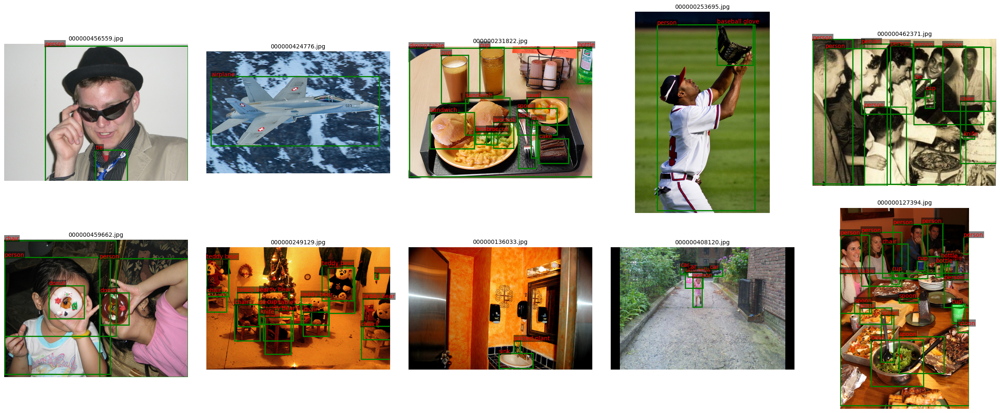

[Dataset Download Link](https://cocodataset.org/#download)

### 3 - Chuẩn bị và tăng cường dữ liệu

#### Chuẩn bị dữ liệu

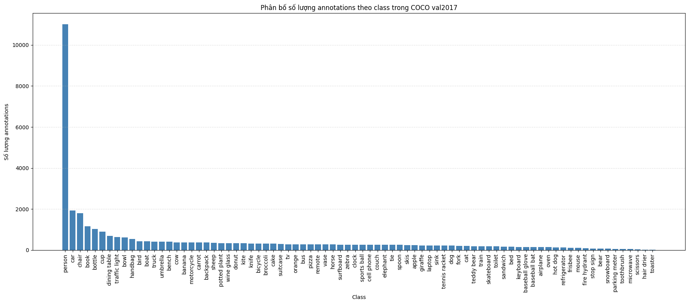

#### Tăng cường dữ liệu

**Pipeline:** Albumentations + `bbox_params` (đồng bộ ảnh & bbox)

- **Flip:** lật ngang → học đối xứng
- **Affine:** scale, dịch, xoay, shear → bền với biến dạng hình học
- **Color (OneOf):** sáng/contrast, HSV, CLAHE → thích nghi ánh sáng
- **Blur/Noise (OneOf):** blur, motion blur, noise → chịu nhiễu/mờ
- **bbox_params:** giữ bbox hợp lệ (format COCO, lọc bbox nhỏ/che khuất, clip)

**Kết quả:** dữ liệu đa dạng hơn → mô hình tổng quát tốt hơn.

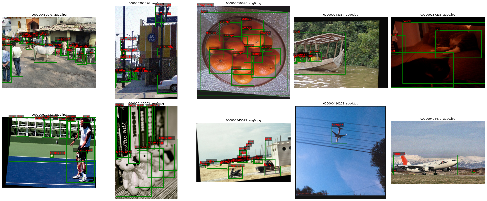

### 4 - Mô hình YOLO

#### Kết quả đánh giá

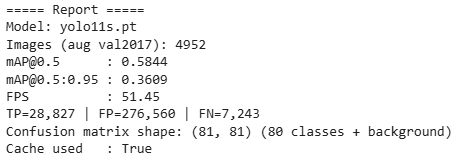

#### Trực quan hóa kết quả đánh giá

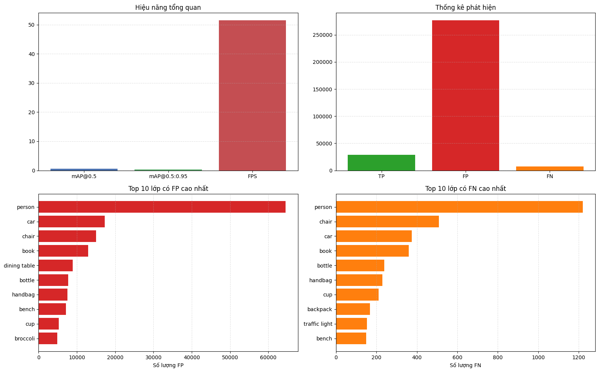

### 5 - Mô hình Faster R-CNN

#### Kết quả đánh giá

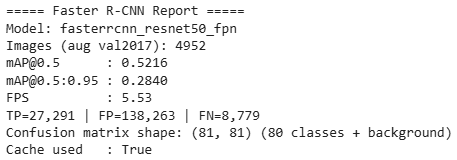

#### Trực quan hóa kết quả đánh giá

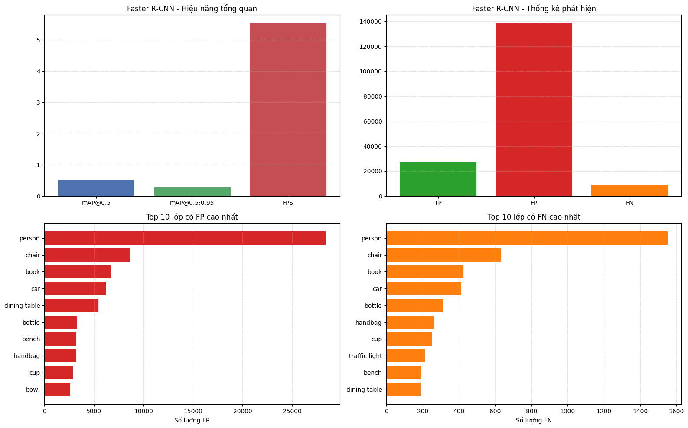

### 6 - Mô hình DETR

#### Kết quả đánh giá

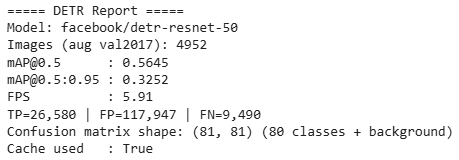

#### Trực quan hóa kết quả đánh giá

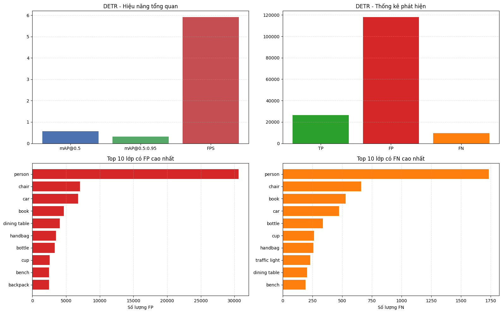

### 7 - So sánh và đánh giá

#### Bảng so sánh các chỉ số hiệu suất

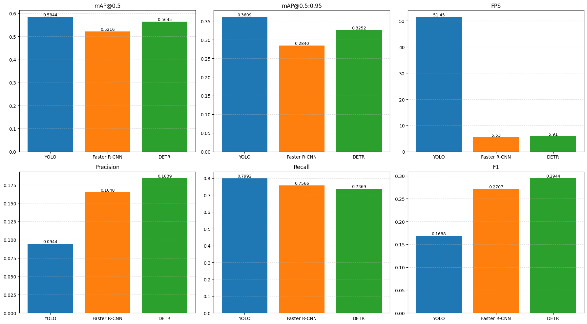

#### Phân tích lỗi (Error Analysis)

### 7.3 - Phân tích lỗi (Error Analysis)

#### Dự đoán từ các mô hình

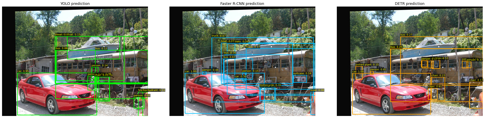

**1) Đặc trưng dữ liệu COCO**

- Mất cân bằng lớp (lớp `person` chiếm ưu thế).
- Vật thể nhỏ/xa → dễ FN, bbox kém chính xác.
- Che khuất, chồng lấp → nhầm lớp, tách bbox kém.
- Bối cảnh phức tạp → tăng FP.

**2) Theo kiến trúc mô hình**

- **YOLO**: ưu tiên tốc độ → dễ FP; nhạy với `conf/iou`; yếu với object nhỏ.
- **Faster R-CNN**: phụ thuộc proposal (RPN) → thiếu proposal gây FN; nhầm lớp gần nhau; phụ thuộc NMS/score.
- **DETR**: kém với object nhỏ/đậm đặc; số query cố định; dễ FN nếu tuning chưa tốt.

**3) Lỗi phổ biến**

- Nhầm giữa các lớp tương tự (book/bottle/cup, car/truck/bus).
- Sai lệch bbox → IoU thấp → bị tính FP/FN.
- Nhận nhầm nền thành object.

**4) Hướng cải thiện**

- Tối ưu `conf`, `iou`, `max_det`.
- Đánh giá theo kích thước object.
- Tăng cường dữ liệu (object nhỏ, occlusion, ánh sáng).
- Dùng ensemble/calibration giảm FP.
- Phân tích và tinh chỉnh theo từng class.

### 8 - Tổng kết

| Nhóm kiến trúc                 | Đại diện         | Ưu điểm                                                                        | Nhược điểm                                                                              | Phù hợp khi                                                          |
| ------------------------------ | ---------------- | ------------------------------------------------------------------------------ | --------------------------------------------------------------------------------------- | -------------------------------------------------------------------- |
| **One-stage (CNN)**            | **YOLO**         | Tốc độ cao, pipeline đơn giản, triển khai realtime tốt                         | Dễ tăng FP, nhạy với ngưỡng `conf/iou`, thường kém hơn ở object nhỏ/khó                 | Cần suy luận nhanh, tài nguyên giới hạn                              |
| **Two-stage (CNN)**            | **Faster R-CNN** | Độ chính xác thường ổn định, localization tốt hơn trong nhiều bối cảnh         | Suy luận chậm hơn, chi phí tính toán cao, pipeline phức tạp hơn                         | Ưu tiên chất lượng hơn tốc độ                                        |
| **Transformer-based detector** | **DETR**         | Thiết kế end-to-end, giảm phụ thuộc hậu xử lý thủ công, biểu diễn ngữ cảnh tốt | FPS thấp hơn, nặng tài nguyên, có thể yếu với object nhỏ/dày đặc nếu chưa tinh chỉnh kỹ | Bài toán cần mô hình hóa quan hệ toàn cục, chấp nhận tốc độ thấp hơn |
